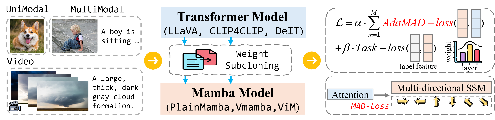

<p align="center">
  <h1 align="center">TransMamba: Fast Universal Architecture Adaption from Transformers to Mamba</h1>
  <p align="center">
    arXiv 2025
  </p>
  <p align="center">
    <a href="https://miicheyang.github.io">Xiuwei Chen</a>,
    <a href="https://transmamba.github.io/" target="_blank">Wentao Hu</a>, 
    <a href="https://transmamba.github.io/" target="_blank">Xiao Dong</a>, 
    <a href="https://transmamba.github.io/" target="_blank">Sihao Lin</a>, 
    <a href="https://transmamba.github.io/" target="_blank">Zisheng Chen</a>, 
    <a href="https://transmamba.github.io/" target="_blank">Meng Cao</a>, 
    <a href="https://transmamba.github.io/" target="_blank">Yina Zhuang</a>, 
    <a href="https://transmamba.github.io/" target="_blank">Jianhua Han</a>, 
    <a href="https://transmamba.github.io/" target="_blank">Hang Xu</a>, 
    <a href="https://transmamba.github.io/" target="_blank">Xiaodan Liang</a>
  </p>
  <p align="center">
    <a href="[https://www.arxiv.org/abs/2506.17218](https://arxiv.org/pdf/2502.15130)">
      
    </a>
    <a href='https://github.com/chen-xw/TransMamba-main' style='padding-left: 0.5rem;'>
      
    </a>
  </p>
</p>


We propose a two-stage framework (TransMamba) to accelerate the training of Mamba-based models, ensuring their effectiveness across both uni-modal and multi-modal tasks.

<p align="center">
    
</p>

<br>

<!-- TABLE OF CONTENTS -->
<details open="open" style='padding: 10px; border-radius:5px 30px 30px 5px; border-style: solid; border-width: 1px;'>
  <summary>Tabel of Contents</summary>
  <ol>
    <li>
      <a href="#installation">Installation</a>
    </li>
    <li>
      <a href="#data-preparation">Data Preparation</a>
    </li>
    <li>
      <a href="#training">Training</a>
    </li>
    <li>
      <a href="#inference">Inference</a>
    </li>
    <li>
      <a href="#citation">Citation</a>
    </li>
    <li>
      <a href="#acknowledgement">Acknowledgement</a>
    </li>
  </ol>
</details>

## News
- [2025-12-05] We have released our code.
- [2025-10-09] We have released our updated paper.
- [2025-02-11] We have released the paper!

## Installation
Create a conda environment and install the required packages:

**Image Classification**
```bash
conda create -n transmamba-imagenet python=3.9
conda activate transmamba-imagenet

git clone https://github.com/chen-xw/TransMamba-main.git
cd TransMamba-main
pip install -r requirements_imagenet.txt
pip install -e causal_conv1d>=1.1.0
pip install -e mamba-1p1p1
```

**Visual Question Answering**
```bash
conda create -n transmamba-llava python=3.10
conda activate transmamba-llava

git clone https://github.com/chen-xw/TransMamba-main.git
cd TransMamba-main
pip install -r requirements_llava.txt
```

## Data Preparation
- Download **ImageNet-1K** from the [official website](https://www.image-net.org/).
- Download **CIFAR-10/CIFAR-100** from the [official website](https://www.cs.toronto.edu/~kriz/cifar.html).
- Download **LLaVA-Data** from the [official website](https://github.com/haotian-liu/LLaVA?tab=readme-ov-file).
- Download **LLaVA-COT-100K** from the [official website](https://github.com/PKU-YuanGroup/LLaVA-CoT).

## Training

**Training and Inference on Image Classification**
```bash
python  main.py \
  --model-type 'PlainMamba' \
  --model-teacher 'deit_tiny_patch16_224' \
  --distillation-type 'soft' \
  --output_dir 'output/' \
  --epochs 300 \
  --batch-size 256
```

**Training on VQA**
```bash
bash worker/SFT_LLaVA_Mamba_Distill.sh
```

## Inference

Our evaluation is based on [`lmms-eval`](https://github.com/EvolvingLMMs-Lab/lmms-eval)


## Citation
If you find our work useful, please consider citing: 

```bibtex
@article{chen2025transmambafastuniversalarchitecture,
      title={TransMamba: Fast Universal Architecture Adaption from Transformers to Mamba}, 
      author={Xiuwei Chen and Wentao Hu and Xiao Dong and Sihao Lin and Zisheng Chen and Meng Cao and Yina Zhuang and Jianhua Han and Hang Xu and Xiaodan Liang},
      year={2025},
      eprint={2502.15130},
      archivePrefix={arXiv},
      primaryClass={cs.CV},
      url={https://arxiv.org/abs/2502.15130}, 
}
```

## Acknowledgement
We would like to thank the following works for their code and models:
- Training: [LLaVA](https://github.com/haotian-liu/LLaVA?tab=readme-ov-file)

