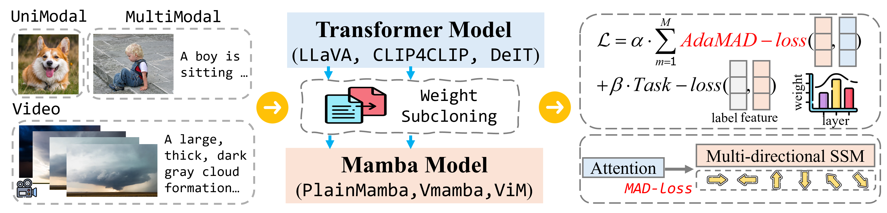

# C2-Evo

[[Paper]](https://www.arxiv.org/abs/)

<table align="center" width="100%" border="0" cellpadding="0" cellspacing="0" style="background-color:#ffffff; padding:20px;">
  <tr>
    <td align="center">
      
    </td>
  </tr>
</table>

This is the homepage for the code release for the preprint "TransMamba: Fast Universal Architecture Adaption from Transformers to Mamba"

Please refer to our paper (linked above) for more details.

## Release Progress

- [ ] TransMamba training code
- [ ] Evaluation code for TransMamba
- [ ] Trained model checkpoints and data

## Contact

Please email Xiuwei (`chenxw83@mail2.sysu.edu.cn`) if you have any questions.
You can also open a GitHub issue if you encounter any bugs or problems.

## Citation

If you use this code in your research, please cite our paper:

```bibtex
@misc{bhaskar2025cache,
    title={TransMamba: Fast Universal Architecture Adaption from Transformers to Mamba}, 
    author={Xiuwei Chen, ...},
    journal={arXiv preprint arXiv:},
    year={2025}
}
```
